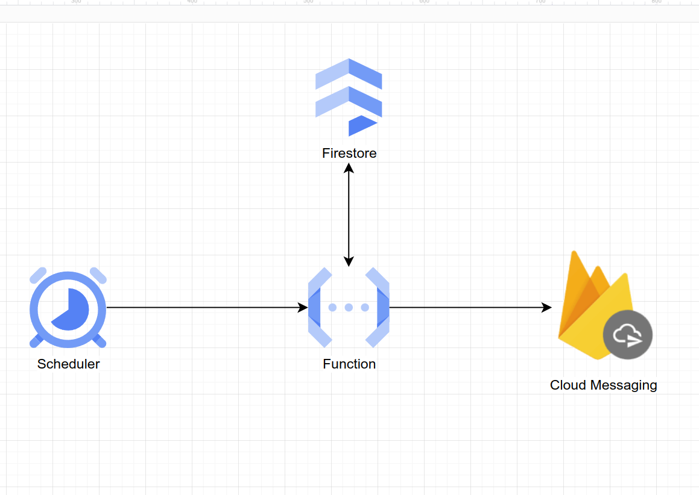

## Getting Started

#### First, setup the environment file first.

```bash
# create .env file based from .env.example
cp .env.example .env

# set necessary values
```

#### Second, run the development server:

```bash
npm run dev
# or
yarn dev
# or
pnpm dev
# or
bun dev
```

#### Third, on second step:

> you can see the rendering url as this


---

## Technical Specification: Streak Reminder Push Notification System

#### Assumptions:

All devices have registered and with respective device tokens, with **Firestore**
All users are authenticated with **Firebase Authentication**.
A users able perform CRUD operations on cases, streaks with **Firestore**

#### Requirements:

- Track user activity to determine the last time they were active.
- Trigger a push notification 24 hours based from last activity.
- The system should scale to handle a large number of users.

#### Sample Records

> sample data for various collection.

##### Device Record

```json
{
  "userId":"1",
  “deviceId”: 1,
  "deviceToken":"123345"
}
```

##### User Record

```json
{
  "id": "1",
  "email": "my@email.com",
  "firstName": "first name",
  "lastName": "last name",
  "lastActivity": "2025-02-05T09:10:57.217Z"
}
```

##### Day Activity Record

```json
{
  "userId": "1",
  "date": "2025-02-05",
  "activities": 10,
  "state": "INCOMPLETE"
}
```

##### Streaks

> note: Can be derived from existing collections


#### Notification Flow

1. **Cloud Scheduler** will run once every 24hrs and interval manner, that will trigger a **Cloud Function**.
2. **Cloud Function** will perform the following:
    1. Query all users from the Firestore ( users collection ) to have no activity in the last 24hrs.
    2. All matching users, will be queried against the device collection to get its designated device tokens. These tokens represent the destination where to send notification messages to users.
    3. Send messages to the **Firebase Cloud Messaging**.

3. **FireCloud Messaging** will handle message sending to designated devices using ***device token***.

##### Diagram
